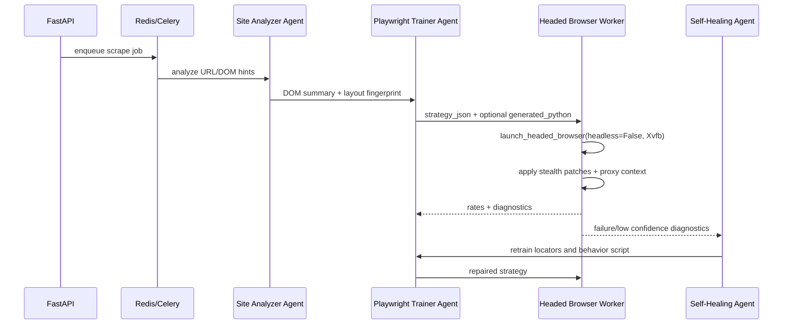

# RentalRadar.ai Self-Hosted Browser Farm

Critical requirement: every scraping session runs real headed Chrome with `headless=False`. Do not use Browserbase, Bright Data Browser, Scrapfly, Browserless, or any external browser API. Linux servers provide a virtual display through Xvfb so Chrome sees a display while still running on headless infrastructure.

## Files

- `apps/api/Dockerfile.browser-worker`
- `apps/api/docker/browser-worker-entrypoint.sh`
- `apps/api/app/browser_farm/headed.py`
- `apps/api/app/browser_farm/stealth.py`
- `apps/api/app/browser_farm/proxy.py`
- `apps/api/app/browser_farm/runner.py`
- `apps/api/app/browser_farm/metrics.py`
- `docker-compose.yml`
- `infra/k8s/browser-farm.yaml`
- `monitoring/prometheus/prometheus.yml`
- `monitoring/grafana/dashboards/browser-farm.json`
- `.github/workflows/ci.yml`

## Local Development

1. Configure API env:

```bash
cp apps/api/.env.example apps/api/.env
```

Make sure these stay set:

```bash
SCRAPER_HEADLESS=false
SCRAPER_STEALTH=true
BROWSER_WORKER_MAX_CONCURRENT_BROWSERS=4
SCRAPER_ALLOW_DETERMINISTIC_FALLBACK=false
```

2. Start local stack with two browser workers:

```bash
docker compose up --build
```

3. Start four local browser workers:

```bash
docker compose --profile scale4 up --build
```

4. Seed residential proxies into Redis:

```bash
docker compose exec redis redis-cli -n 0 RPUSH rentalradar:proxy_pool \
  '{"server":"http://res-proxy-1.example:8000","username":"user","password":"pass","provider":"oxylabs"}' \
  '{"server":"http://res-proxy-2.example:8000","username":"user","password":"pass","provider":"iproyal"}'
```

5. Verify metrics:

```bash
curl http://localhost:9108/metrics
curl http://localhost:9090
open http://localhost:3002
```

Grafana defaults:

- URL: `http://localhost:3002`
- User: `admin`
- Password: `admin`

## Single VPS Deployment

Recommended minimum VPS for a lean production pilot:

- 8 vCPU
- 32 GB RAM
- 150 GB NVMe
- Ubuntu 24.04 LTS
- Docker Engine and Compose plugin

Each headed Chrome session normally uses 300-600 MB RAM and bursts CPU during navigation/rendering. A practical cost-aware starting point is 8 concurrent browsers per VPS:

- 2 browser worker containers
- `BROWSER_WORKER_MAX_CONCURRENT_BROWSERS=4`
- Celery `--concurrency=4` per worker
- `/dev/shm` at least 1 GB per worker container

Deploy:

```bash
git clone https://github.com/jamiegreene736-debug/RentalRadar.git
cd RentalRadar
cp apps/api/.env.example apps/api/.env
```

Set production values in `apps/api/.env`:

```bash
ENVIRONMENT=production
DATABASE_URL=postgresql+psycopg://...
REDIS_URL=redis://...
CELERY_BROKER_URL=redis://...
CELERY_RESULT_BACKEND=redis://...
TOKEN_ENCRYPTION_KEY=...
SCRAPER_HEADLESS=false
BROWSER_WORKER_MAX_CONCURRENT_BROWSERS=4
SCRAPER_PROXY_REDIS_KEY=rentalradar:proxy_pool
SCRAPER_REQUIRE_RESIDENTIAL_PROXY=true
BRIGHTDATA_PROXY_SERVER=http://brd.superproxy.io:33335
BRIGHTDATA_PROXY_USERNAME=...
BRIGHTDATA_PROXY_PASSWORD=...
```

If the provider dashboard gives split fields instead of a full proxy URL, set
`BRIGHTDATA_PROXY_HOST`, `BRIGHTDATA_PROXY_PORT`, `BRIGHTDATA_PROXY_USERNAME`,
and `BRIGHTDATA_PROXY_PASSWORD`; the worker composes the Playwright proxy server
from those values and keeps credentials separate from the server URL.

Run:

```bash
docker compose up -d --build postgres redis api browser-worker-1 browser-worker-2 beat prometheus grafana
```

Scale to four workers if CPU and RAM allow:

```bash
docker compose --profile scale4 up -d --build
```

Restart policy:

- Compose services use `restart: unless-stopped`.
- Celery uses `--max-tasks-per-child=20` to recycle long-lived Chrome memory.
- Browser sessions are isolated per job and closed in `finally` blocks.

## Kubernetes Deployment

1. Build and push the browser worker image:

```bash
docker build -f apps/api/Dockerfile.browser-worker -t ghcr.io/YOUR_ORG/rentalradar-browser-worker:latest apps/api
docker push ghcr.io/YOUR_ORG/rentalradar-browser-worker:latest
```

2. Edit `infra/k8s/browser-farm.yaml`:

- Replace image with your GHCR/ECR registry.
- Replace Postgres/Redis secrets.
- Keep `SCRAPER_HEADLESS=false`.

3. Apply:

```bash
kubectl apply -f infra/k8s/browser-farm.yaml
```

4. Scale:

```bash
kubectl -n rentalradar get hpa
kubectl -n rentalradar scale deploy/rentalradar-browser-worker --replicas=4
```

Sizing guidance:

- Pod request: `1500m CPU`, `3Gi RAM`
- Pod limit: `3500m CPU`, `6Gi RAM`
- Default: 4 concurrent browsers per pod
- 16 GB node: 2 pods, about 8 concurrent browsers
- 32 GB node: 4 pods, about 16 concurrent browsers
- 64 GB node: 8 pods, about 32 concurrent browsers if CPU supports it

For the requested 5-20 concurrent browsers per node:

- 5 browsers/node: 1-2 pods, `BROWSER_WORKER_MAX_CONCURRENT_BROWSERS=3`
- 10 browsers/node: 3 pods, `BROWSER_WORKER_MAX_CONCURRENT_BROWSERS=3-4`
- 20 browsers/node: 5 pods, `BROWSER_WORKER_MAX_CONCURRENT_BROWSERS=4`, 64 GB RAM preferred

Do not overcommit memory. Chrome OOM kills are more expensive than running one extra worker node.

## How Agents Call the Browser Farm

Current flow:



Direct trained-code task payload:

```python
from app.workers.tasks import run_trained_scraping_script_task

run_trained_scraping_script_task.delay({
    "job_id": "scrape-job-uuid",
    "target": {
        "source": "airbnb",
        "url": "https://www.airbnb.com/rooms/...",
        "stay_date_start": "2026-06-01",
        "stay_date_end": "2026-06-30",
    },
    "strategy": {
        "domain": "www.airbnb.com",
        "layout_fingerprint": "abc123",
        "confidence": 0.82,
        "strategy_json": {
            "generated_python": '''
async def scrape(page, context, target, strategy, human):
    await page.goto(target.url, wait_until="domcontentloaded", timeout=60000)
    await human["scroll"](page)
    title = await page.title()
    return {
        "rates": [],
        "confidence": 0.7,
        "diagnostics": {"title": title}
    }
''',
            "validators": {"min_confidence": 0.6}
        }
    }
})
```

The generated script receives:

- `page`: headed Playwright page
- `context`: isolated browser context
- `target`: `ScrapeTarget`
- `strategy`: `strategy_json`
- `human`: helpers for scrolling and typing with delays

## Stealth Patch Coverage

Implemented in `apps/api/app/browser_farm/stealth.py`:

1. `navigator.webdriver = undefined`
2. WebGL vendor/renderer randomization
3. Font enumeration surface
4. Canvas and WebGL noise
5. Chrome APIs, plugins, languages
6. Hardware concurrency and device memory spoofing
7. Human-like mouse movement, scrolling, and typing delays

## Monitoring

Metrics exposed by each browser worker on `BROWSER_WORKER_METRICS_PORT`:

- `rentalradar_browser_active`
- `rentalradar_browser_launch_failures_total`
- `rentalradar_scrape_success_total`
- `rentalradar_scrape_failure_total`
- `rentalradar_scrape_duration_seconds`
- `rentalradar_proxy_usage_total`
- `rentalradar_celery_queue_length`
- `rentalradar_worker_memory_bytes`

Dashboard panels:

- Active headed browsers
- Queue length by queue
- Scrape success/failure rate
- Proxy usage by provider

Alert rules to add in Prometheus/Grafana:

- Queue length > 100 for 10 minutes
- Success rate < 80% for 15 minutes
- Worker memory > 85% of limit for 10 minutes
- Browser launch failures > 5 in 10 minutes
- Proxy failure count spikes by provider

## Cost Controls

- Keep `worker_prefetch_multiplier=1` so a worker only reserves work it can run.
- Use `BROWSER_WORKER_MAX_CONCURRENT_BROWSERS=2-4` on small nodes.
- Use `--max-tasks-per-child=20` to recycle Chrome memory.
- Run scheduled scan frequency by plan tier.
- Record `usage_events` before queueing work.
- Use HPA scale-down stabilization to avoid thrashing.
- Prefer cheaper Hetzner/OVH CPU/RAM nodes for browser workers, while keeping Postgres managed on Supabase/Neon.
